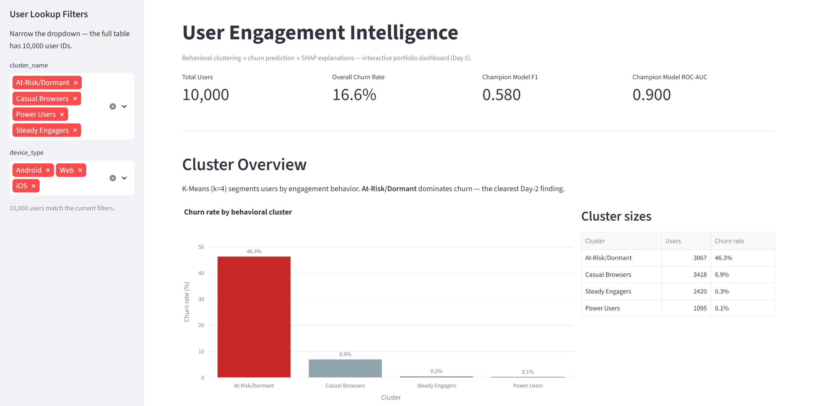
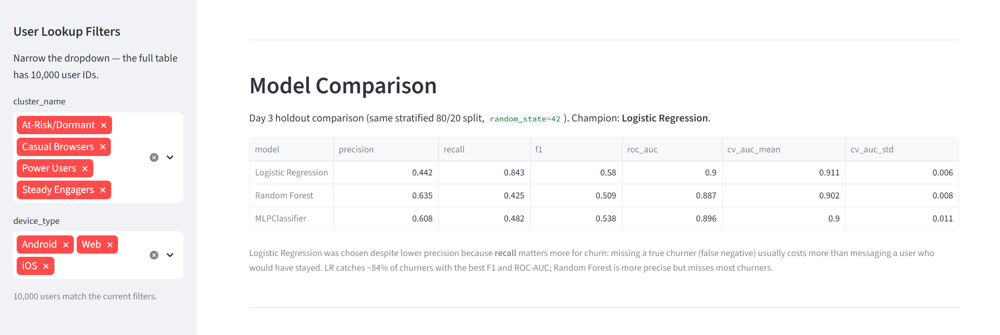
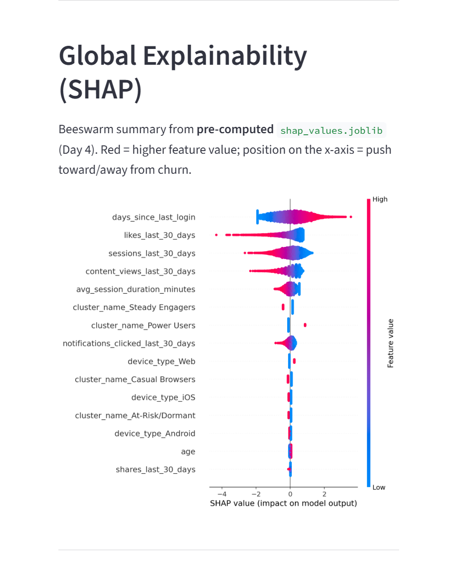
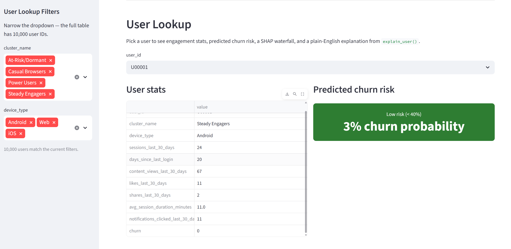
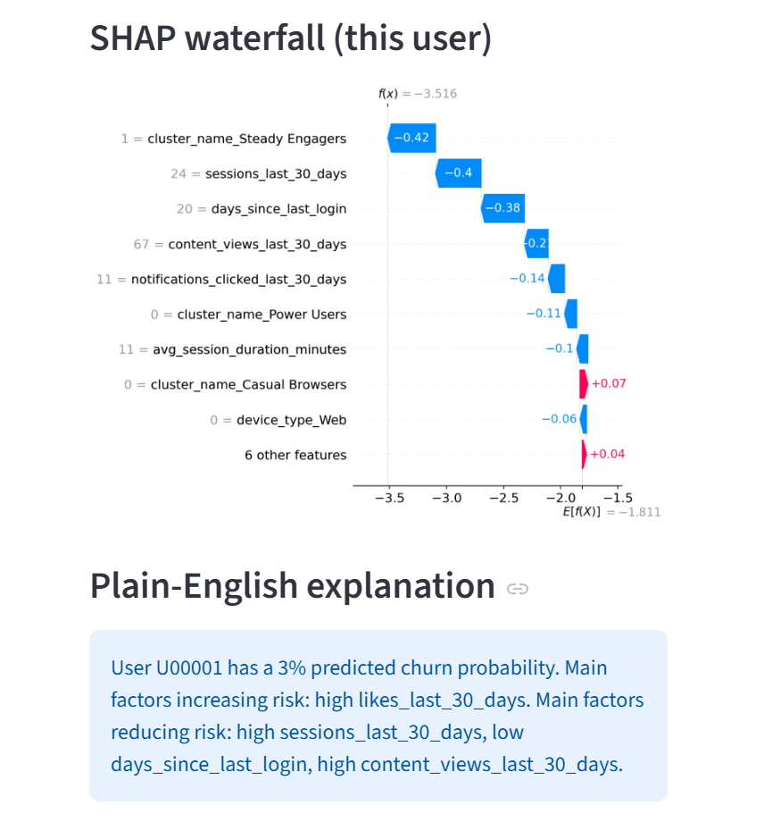

# 📊 User Engagement Intelligence

**Behavioral segmentation → churn prediction → explainable AI, in one interactive dashboard.**


---

## 🧠 Problem

Content and engagement platforms lose users silently — by the time churn shows up in the numbers, it's too late to act. This project builds a system that:

1. **Segments** users into behavioral tiers using unsupervised clustering
2. **Predicts** which individual users are likely to churn
3. **Explains** *why*, in plain English, for every single prediction

All wrapped in a live dashboard a product or growth team could actually use.

---

## 📸 Screenshots







---

## 🔑 Key Findings

- **Behavioral clusters predict churn far better than any single feature.** The *At-Risk/Dormant* segment churns at **46.3%**, compared to just **0.1%** for *Power Users* — a 400x+ gap.
- **Recall matters more than precision for this problem.** Logistic Regression was chosen as the champion model (F1 0.58, ROC-AUC 0.90) over Random Forest despite lower precision, because it catches **84% of actual churners** — missing a churner costs more than one extra retention message.
- **Recency and session frequency dominate the churn signal.** SHAP analysis shows `days_since_last_login` and `sessions_last_30_days` as the top global drivers of predicted churn risk.
- **Features can be reconstructed from raw event logs, not just clean CSVs.** A SQL pipeline over a simulated 733K-event database reproduces the same engagement features with 100% match on counts and <0.3 min error on durations — mirroring how this would work on real production data.

---

## 🏗️ Architecture

```
Raw event logs (SQLite: users, sessions, engagement_events)
        │
        ▼
   SQL feature engineering  ──────────────┐
        │                                 │
        ▼                                 ▼
   pandas feature matrix          (cross-check vs. CSV)
        │
        ▼
   K-Means Clustering  →  behavioral segments (4 tiers)
        │
        ▼
   Churn Classification  →  Logistic Regression / Random Forest / MLPClassifier
        │
        ▼
   SHAP Explainability  →  global drivers + per-user waterfall
        │
        ▼
   Streamlit Dashboard  →  KPIs, cluster viz, model comparison, user lookup
```

---

## 📈 Results

### Cluster profile

| Segment | Users | Churn rate |
|---|---:|---:|
| 🔴 At-Risk/Dormant | 3,067 | **46.3%** |
| 🟡 Casual Browsers | 3,418 | 6.9% |
| 🟢 Steady Engagers | 2,420 | 0.3% |
| 🟢 Power Users | 1,095 | 0.1% |

### Model comparison (held-out test set)

| Model | Precision | Recall | F1 | ROC-AUC |
|---|---:|---:|---:|---:|
| **Logistic Regression** ⭐ | 0.442 | **0.843** | **0.580** | **0.900** |
| Random Forest | 0.635 | 0.425 | 0.509 | 0.887 |
| MLPClassifier (Neural Net) | 0.608 | 0.482 | 0.538 | 0.896 |

*Champion: Logistic Regression — chosen for recall, since catching a true churner matters more than avoiding a false alarm.*

---

## 🛠️ Tech Stack

| Layer | Tools |
|---|---|
| Data & features | pandas, numpy, SQLite |
| Clustering | scikit-learn (K-Means), PCA |
| Classification | scikit-learn (Logistic Regression, Random Forest, MLPClassifier) |
| Explainability | SHAP |
| Dashboard | Streamlit, Plotly |
| Tooling | joblib, matplotlib, seaborn |

---

## 🚀 Run it locally

```bash
git clone https://github.com/Dhidhi14/user-engagement-intelligence.git
cd user-engagement-intelligence

pip install -r requirements.txt

# (optional) rebuild the SQLite database from scratch
python src/build_features_sql.py

streamlit run app.py
```

Then open **http://localhost:8501**.

---

## 📁 Project Structure

```
user-engagement-intelligence/
├── assets/                         # Screenshots for this README
├── app.py                          # Streamlit dashboard (main deliverable)
├── data/
│   ├── users.csv                   # Raw synthetic user data
│   ├── users_with_clusters.csv     # + cluster assignments
│   └── engagement.db               # SQLite: users, sessions, engagement_events
├── models/                         # Saved models, scalers, SHAP artifacts
├── notebooks/
│   ├── 01_eda.ipynb
│   ├── 02_clustering.ipynb
│   ├── 03_churn_prediction.ipynb
│   ├── 04_explainability.ipynb
│   └── 05_sql_features.ipynb
├── src/
│   ├── generate_data.py
│   ├── clustering.py
│   ├── explain.py
│   └── build_features_sql.py
└── requirements.txt
```

---

## 🗓️ Build Log

| Day | Focus | Outcome |
|---|---|---|
| 1 | Data + EDA | Realistic synthetic dataset, churn correlations verified (0.28–0.50 range) |
| 2 | Clustering | K-Means (k=4), 46.3% vs 0.1% churn spread across segments |
| 3 | Churn Prediction | 3-model comparison, Logistic Regression champion (recall-optimized) |
| 4 | Explainability + SQL | SHAP global/local explanations, SQL feature pipeline verified |
| 5 | Dashboard | Full interactive Streamlit app tying every layer together |

---

## 📬 Contact

Built by **Dhirendra** — [GitHub](https://github.com/Dhidhi14)
